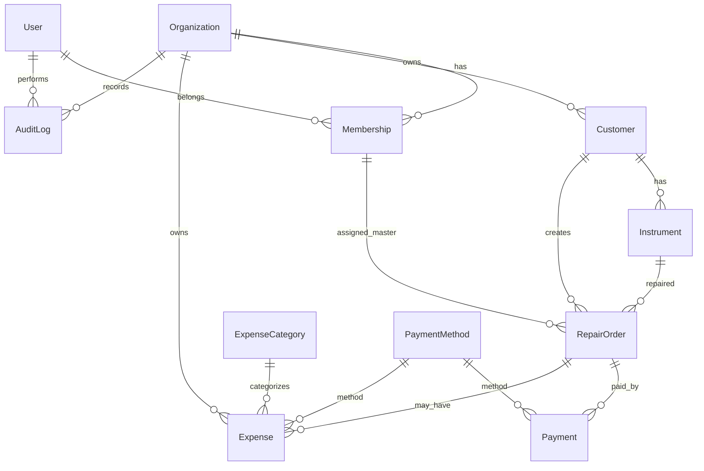
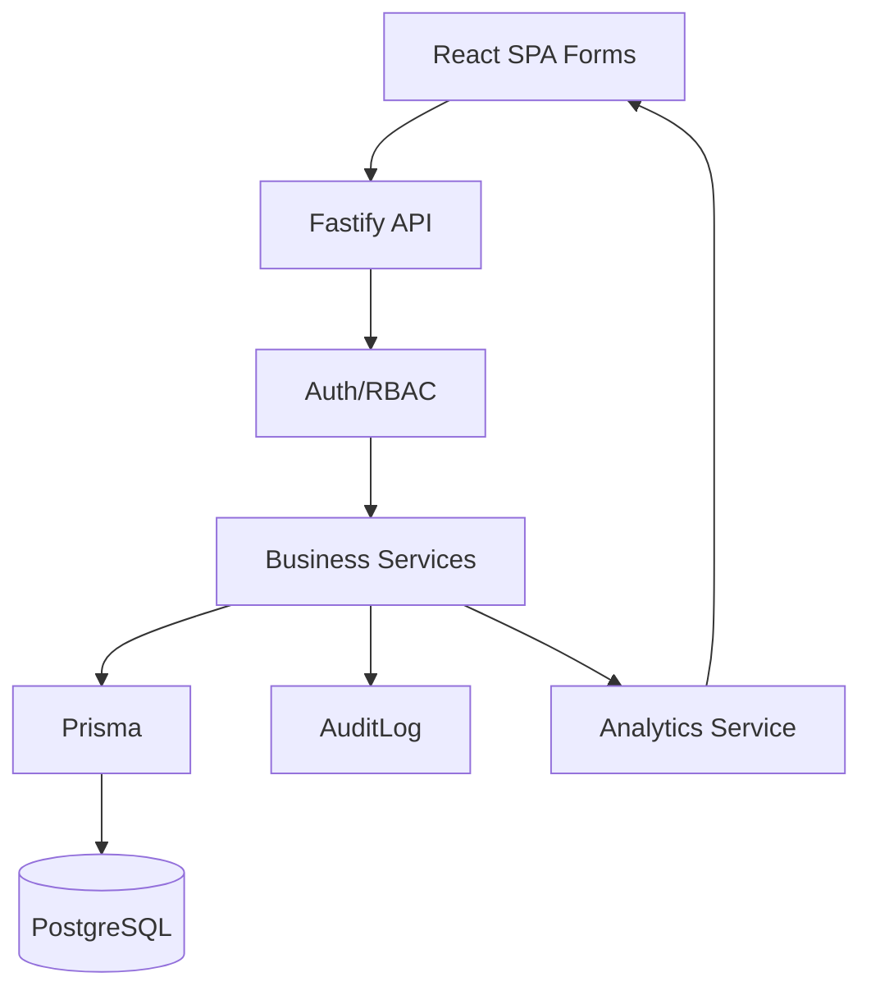

# Domain Map

```mermaid
erDiagram
  Organization ||--o{ Membership : has
  User ||--o{ Membership : belongs
  Organization ||--o{ Customer : owns
  Customer ||--o{ Instrument : has
  Customer ||--o{ RepairOrder : creates
  Instrument ||--o{ RepairOrder : repaired
  Membership ||--o{ RepairOrder : assigned_master
  RepairOrder ||--o{ Payment : paid_by
  RepairOrder ||--o{ Expense : may_have
  Organization ||--o{ Expense : owns
  ExpenseCategory ||--o{ Expense : categorizes
  PaymentMethod ||--o{ Payment : method
  PaymentMethod ||--o{ Expense : method
  Organization ||--o{ AuditLog : records
  User ||--o{ AuditLog : performs
```

## Поток данных

```mermaid
flowchart TD
  UI[React SPA Forms] --> API[Fastify API]
  API --> RBAC[Auth/RBAC]
  RBAC --> Service[Business Services]
  Service --> Prisma[Prisma]
  Prisma --> PG[(PostgreSQL)]
  Service --> Audit[AuditLog]
  Service --> Analytics[Analytics Service]
  Analytics --> UI
```
